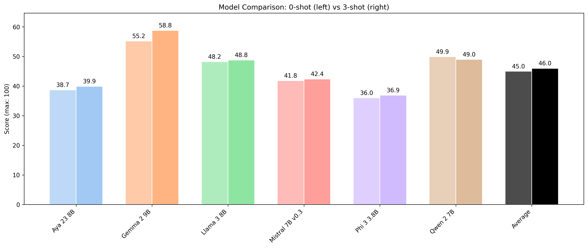
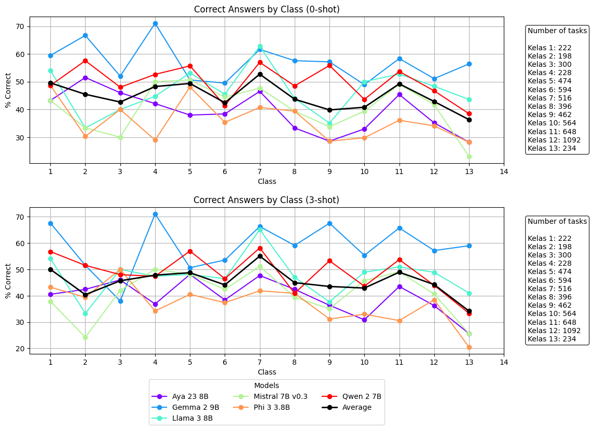
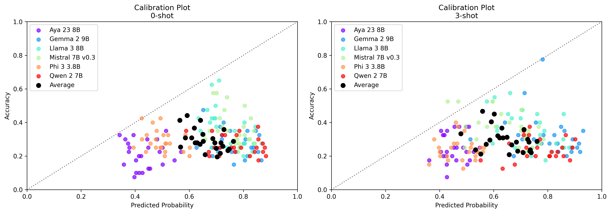

# 4-Bit-IndoMMLU

## Summary
- Evaluated 6 small instruction-tuned models in 4 bit quantization for 1000 samples of the IndoMMLU task
- Models are tested in 0-shot and 3-shot settings
- Gemma 2 9B emerge as the clear winner with the highest overall score and is the only model to have the most gains from 3-shot evaluation
- Aya 23 8B, despite being trained to specialise in multilingualism, scored the second-lowest among the evaluated models
- Regional language subjects have the lowest scores, while social science and humanities tend to be the highest

## Training configuration
Using the IndoMMLU benchmark, 6 small instruction-tuned models are evaluated in 4 bit quantization. 1000 tasks are sampled from the test, and the number of tasks are equally distributed among the 25 available subjects (40 tasks per subject). All evaluations are next-token predictions (`by_letter`), as full-context evaluations take too long to run with the current resources. Models are evaluated in both 0-shot and 3-shot settings, with the 3-shot prompt template directly taken from the original paper (https://arxiv.org/abs/2310.04928). All models are evaluated with a single A100.

Training code is available in Eval Notebook.ipynb (modified from the )

## Model details
| Model | Release/Report | Remarks |
| --- | --- | --- |
| Aya 23 8B |  | Developed explicitly with multilingualism as the main goal, and demonstrated strong performance in multilingual benchmarks |
| Gemma 2 9B |  | Highly capable small model, with recent chatbot arena scores higher or very close to previous GPT-4 versions. Described in the report as not trained for multilingualism in mind. |
| Llama 3 8B | ) | Highly capable small model, with relatively small multilingual data (stated to be "over 5%" for 30 languages in the release). |
| Mistral 7B v0.3 | NA for this version | Capable model from a Western but non-English company, which may have stronger non-English performance |
| Phi 3 3.8B |  | Highly capable small model, especially for the size, but mostly trained on English-language data |
| Qwen 2 7B |  | Capable model, developed with extra attention for multilingual data |

## Results
### Overall score
Below are the scores for each of the models for both 0-shot and 3-shot settings. Notably, despite Aya being highlighted as a highly-capable multilingual model, it has the second-lowest scores among all of the models evaluated. It is only slightly above Phi 3, the worst performer, which itself is understandable as it is reported to be trained dominantly on English-language data.

The second-best performing model is Qwen 2 7B, which may arise due to the developers' explicit attention for multilingual data. The strongest model, however, is Gemma 2 9B, Google's most recent model, which scores far and above other models. Gemma 2's strong performance appears contradictory to the technical report's disclaimer that the model was not developed for strong multilingualism. 

Notably, too, is that the models have little performance gains in 3-shot settings. All of the gains except for Gemma 2 is less than 1 percentile points difference, and some even had decreasing scores. Gemma 2 has the highest gains, but is still a relatively small increase of 3.6 percentile points. On average, 3-shot prompts only increase the scores by a measly 1 percentile point.

### Breakdown by class
Below are the percentage of correct answers for each models broken down by class (grade). As the class progresses upwards there doesn't appear to be a clear trend of increasing or decreasing scores (they tend to fluctuate). The exception is the undergraduate level (13), where all models except for Gemma 2 seeing decreasing scores. The trend appears to be the same for 0-shot and 3-shot settings.

### Breakdown by subject
Below are tables for the model scores broken down by subject (click to expand). Perhaps unsurprisingly, regional language subjects tend to have the lowest scores among all models. However, the models appear to score better for social science and humanities tasks.

0-shot results

| subject | Average | Aya 23 8B | Gemma 2 9B | Llama 3 8B | Mistral 7B v0.3 | Phi 3 3.8B | Qwen 2 7B |
| --- | --- | --- | --- | --- | --- | --- | --- |
| Total | 44.97 | 38.7 | 55.2 | 48.2 | 41.8 | 36 | 49.9 |
| IPS | 62.92 | 57.5 | 82.5 | 65 | 55 | 55 | 62.5 |
| PPKN | 60.42 | 47.5 | 72.5 | 75 | 55 | 52.5 | 60 |
| IPA | 60 | 50 | 72.5 | 67.5 | 42.5 | 45 | 82.5 |
| Bahasa Indonesia | 58.33 | 55 | 70 | 65 | 40 | 55 | 65 |
| Kesenian | 56.25 | 67.5 | 62.5 | 45 | 60 | 35 | 67.5 |
| Agama Kristen | 53.75 | 52.5 | 62.5 | 65 | 50 | 30 | 62.5 |
| Agama Islam | 52.08 | 47.5 | 62.5 | 67.5 | 37.5 | 40 | 57.5 |
| Agama Hindu | 51.25 | 42.5 | 50 | 60 | 50 | 45 | 60 |
| Ekonomi | 51.25 | 42.5 | 70 | 52.5 | 42.5 | 45 | 55 |
| Sejarah | 48.33 | 42.5 | 62.5 | 65 | 37.5 | 32.5 | 50 |
| Penjaskes | 47.08 | 37.5 | 52.5 | 52.5 | 55 | 27.5 | 57.5 |
| Budaya Alam Minangkabau | 45.42 | 37.5 | 55 | 52.5 | 45 | 35 | 47.5 |
| Sosiologi | 44.17 | 42.5 | 52.5 | 42.5 | 52.5 | 20 | 55 |
| Fisika | 44.17 | 32.5 | 65 | 40 | 40 | 42.5 | 45 |
| Biologi | 43.33 | 27.5 | 47.5 | 52.5 | 47.5 | 37.5 | 47.5 |
| Bahasa Sunda | 43.33 | 30 | 60 | 52.5 | 42.5 | 27.5 | 47.5 |
| Bahasa Banjar | 42.92 | 42.5 | 55 | 32.5 | 47.5 | 35 | 45 |
| Bahasa Bali | 36.25 | 32.5 | 37.5 | 32.5 | 35 | 40 | 40 |
| Geografi | 35.83 | 27.5 | 50 | 35 | 25 | 32.5 | 45 |
| Bahasa Lampung | 35.83 | 32.5 | 42.5 | 40 | 40 | 35 | 25 |
| Kimia | 34.58 | 27.5 | 40 | 45 | 35 | 22.5 | 37.5 |
| Bahasa Makassar | 31.25 | 27.5 | 37.5 | 22.5 | 30 | 37.5 | 32.5 |
| Bahasa Dayak Ngaju | 28.75 | 32.5 | 30 | 17.5 | 22.5 | 30 | 40 |
| Bahasa Madura | 28.75 | 17.5 | 40 | 27.5 | 35 | 22.5 | 30 |
| Bahasa Jawa | 27.92 | 15 | 47.5 | 32.5 | 22.5 | 20 | 30 |

3-shot results

  
| subject | Average | Aya 23 8B | Gemma 2 9B | Llama 3 8B | Mistral 7B v0.3 | Phi 3 3.8B | Qwen 2 7B |
| --- | --- | --- | --- | --- | --- | --- | --- |
| Total | 45.97 | 39.9 | 58.8 | 48.8 | 42.4 | 36.9 | 49 |
| PPKN | 68.33 | 67.5 | 87.5 | 75 | 62.5 | 50 | 67.5 |
| IPS | 63.33 | 60 | 80 | 67.5 | 55 | 52.5 | 65 |
| IPA | 62.08 | 50 | 85 | 60 | 47.5 | 47.5 | 82.5 |
| Bahasa Indonesia | 60 | 50 | 77.5 | 65 | 42.5 | 65 | 60 |
| Agama Kristen | 58.75 | 57.5 | 82.5 | 65 | 52.5 | 35 | 60 |
| Agama Islam | 56.67 | 47.5 | 70 | 67.5 | 47.5 | 45 | 62.5 |
| Ekonomi | 55.83 | 52.5 | 75 | 50 | 45 | 42.5 | 70 |
| Agama Hindu | 54.58 | 45 | 65 | 60 | 52.5 | 50 | 55 |
| Kesenian | 54.58 | 60 | 67.5 | 52.5 | 55 | 30 | 62.5 |
| Sosiologi | 47.92 | 40 | 55 | 47.5 | 52.5 | 37.5 | 55 |
| Sejarah | 47.5 | 35 | 62.5 | 65 | 50 | 25 | 47.5 |
| Penjaskes | 47.08 | 40 | 62.5 | 50 | 47.5 | 32.5 | 50 |
| Biologi | 47.08 | 37.5 | 52.5 | 50 | 50 | 50 | 42.5 |
| Fisika | 44.17 | 42.5 | 65 | 47.5 | 42.5 | 30 | 37.5 |
| Bahasa Sunda | 43.33 | 30 | 62.5 | 40 | 50 | 25 | 52.5 |
| Bahasa Banjar | 42.5 | 47.5 | 42.5 | 42.5 | 37.5 | 42.5 | 42.5 |
| Budaya Alam Minangkabau | 42.08 | 42.5 | 40 | 55 | 40 | 30 | 45 |
| Bahasa Lampung | 37.92 | 17.5 | 52.5 | 45 | 35 | 45 | 32.5 |
| Bahasa Makassar | 36.67 | 30 | 40 | 32.5 | 30 | 42.5 | 45 |
| Bahasa Bali | 36.25 | 27.5 | 47.5 | 35 | 40 | 25 | 42.5 |
| Geografi | 32.92 | 22.5 | 52.5 | 32.5 | 30 | 22.5 | 37.5 |
| Kimia | 32.92 | 20 | 47.5 | 40 | 32.5 | 27.5 | 30 |
| Bahasa Jawa | 32.5 | 25 | 47.5 | 40 | 30 | 30 | 22.5 |
| Bahasa Dayak Ngaju | 23.33 | 32.5 | 20 | 15 | 17.5 | 22.5 | 32.5 |
| Bahasa Madura | 20.83 | 17.5 | 30 | 20 | 15 | 17.5 | 25 |

### Model calibration

Below are calibration plots for all models grouped by subject. The x axis indicate the mean prediction confidence, while the y axis indicate the model accuracies for that subject. Points above the diagonal indicate underconfidence, while points below it indicate overconfidence. For all models in both 0-shot and 3-shot settings, the predictions tend to be overconfident. Ideally, the points are as close as possible to the diagonal lines.

Below are Pearson correlation (r) tables for each of the models. Values closer to 1 indicate better calibration.

| Model | 0-shot | 3-shot |
|-------|------------------|------------------|
| Aya 23 8B | 0.0023 | 0.0976 |
| Gemma 2 9B | -0.2447 | -0.2258 |
| Llama 3 8B | -0.5766 | -0.5221 |
| Mistral 7B v0.3 | -0.3186 | -0.4903 |
| Phi 3 3.8B | -0.3152 | 0.0170 |
| Qwen 2 7B | -0.2280 | 0.1308 |

## Discussion
In the original IndoMMLU paper, GPT 3.5 has the highest reported overall score of 53.2 (0-shot), with the open models trailing significantly behind it with scores around ~20. All of the evaluated models except for Gemma 2 have scores below GPT 3.5, but given the small model size and the 4 bit quantization, the models provide relatively competitive scores.

Surprisingly, Aya 23 8B, which was developed especially for multilingualism, perform quite poorly in the benchmark, only above Phi 3 which itself was trained dominantly on English data. Gemma 2 was claimed by Google to not be developed for strong multilingualism, but was surprisingly the strongest model in the benchmark. For downstream Indonesian tasks, Gemma 2 may be the best choice.

None of the models except for Gemma 2 appear to substantially benefit from 3-shot prompting. This is not completely strange, however, as the original IndoMMLU paper also show that some models experience performance loss rather than gain in few-shot settings.

Additionally, the evaluated models have very poor confidence calibration, with all of the models tending towards overconfidence. This is a stark contrast compared to the calibration of the models in the original paper, where many of the models plot very close to the diagonal, despite of some of the models have substantially lower overall scores compared to ones currently tested.

It's possible that the models' performance are differentially hurt by quantization. Some models may experience more substantial loss than others compared to the original fp16 version, although this was not tested. It may be worth investigating model performance in fp16.

## Conclusion
To conclude, among the evaluated 4 bit models, Gemma 2 9B appears to be the most fitting model for Indonesian tasks. However, all of the models are poorly calibrated and appear to benefit little from 3-shot prompting. It may be worth investigating performance of models in the original fp16, as quantization may damage different models to different extents.
